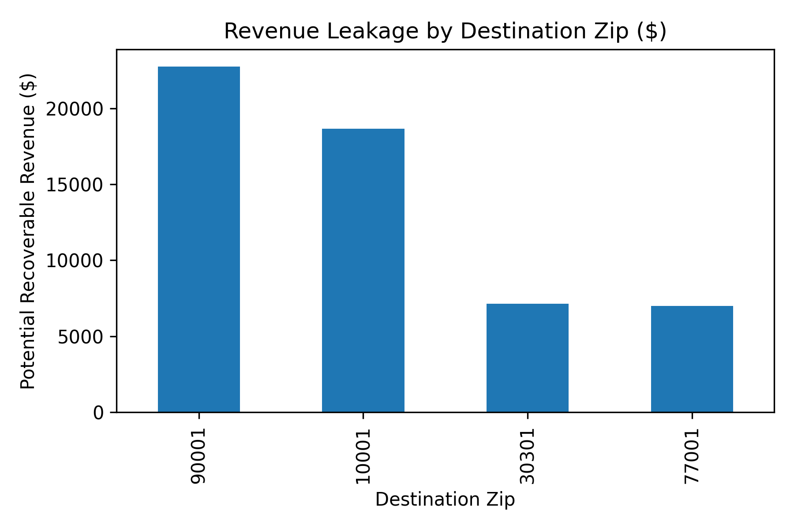

# Freight-RevIQ 🚚  
**Automated Revenue Leakage Detection Engine for Freight Billing Systems**

## 📦 Overview
Freight-RevIQ is a Python-based analytics engine that simulates how revenue quality teams at freight carriers (like FedEx Freight) detect and prevent revenue leakage.  
It compares **expected billing amounts** (based on shipment data and rate logic) against **actual invoiced totals**, automatically flagging underbilled shipments, missing surcharges, and billing anomalies.

This project demonstrates practical skills in **data validation, financial reconciliation, anomaly detection**, and **data visualization** — all key capabilities for Revenue Quality & Data Governance roles.

---

## 🧠 Key Features
- **Expected Rate Modeling:** Calculates theoretical charges using freight class, weight, distance, and surcharges.
- **Automated Leakage Detection:** Flags underbilled shipments using rule-based and statistical checks.
- **Accessorial Fee Validation:** Identifies missing liftgate or residential fees.
- **Anomaly Analytics:** Detects unusual billing patterns through z-score outlier analysis.
- **Audit-Ready Output:** Exports a detailed CSV report of recoverable revenue and a visual dashboard of leakage KPIs.

---

## 🧾 Data Schema

### `shipments.csv`
| Column | Description |
|--------|--------------|
| shipment_id | Unique shipment reference |
| ship_date | Shipment date |
| origin_zip / dest_zip | Origin and destination ZIP codes |
| freight_class | Classification of freight (affects base rate) |
| weight_lbs | Weight of the shipment |
| distance_miles | Mileage between origin and destination |
| liftgate_required | Whether a liftgate service was needed |
| residential_delivery | Whether the delivery was residential |
| fuel_surcharge_rate | Fuel surcharge percentage |

### `billing.csv`
| Column | Description |
|--------|--------------|
| base_linehaul_charge | Core transportation cost |
| billed_fuel_surcharge | Fuel fee billed to customer |
| billed_liftgate_fee | Liftgate service fee billed |
| billed_residential_fee | Residential delivery fee billed |
| total_billed_amount | Final invoice amount |

---

## ⚙️ Workflow
1. **Load data** from `data/shipments.csv` and `data/billing.csv`  
2. **Compute expected charges** using internal pricing logic  
3. **Compare expected vs. actual** totals to find anomalies  
4. **Generate exception report** summarizing underbilled shipments  
5. **Visualize KPIs** for leakage by customer or destination  



---

## 📊 Example Output
| shipment_id | expected_total | actual_billed | leakage_amount | leakage_reason |
|--------------|----------------|----------------|----------------|----------------|
| SHP-1002 | 24,935.00 | 2,195.00 | 22,740.00 | Underbilled by 91.2%; Fuel surcharge not billed |
| SHP-1004 | 20,525.75 | 1,610.00 | 18,645.75 | Liftgate & Residential fees missing |

---

## 🧩 Tech Stack
- **Python:** pandas, numpy, matplotlib  
- **Notebook:** Jupyter / JupyterLab  
- **Output:** CSV report + KPI visualization  

---

## 🚀 How to Run
1. Clone the repository  
   ```bash
   git clone https://github.com/Joshitha-Uppalapati/freight-revIQ.git
   cd freight-revIQ

